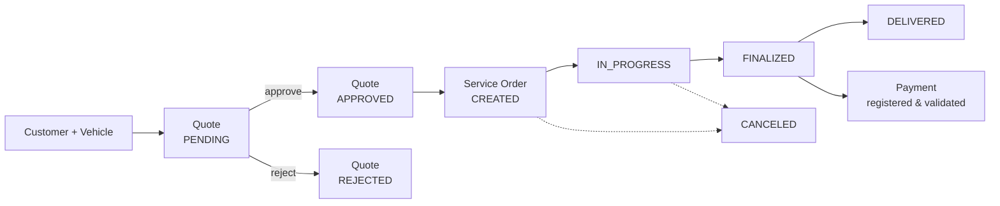
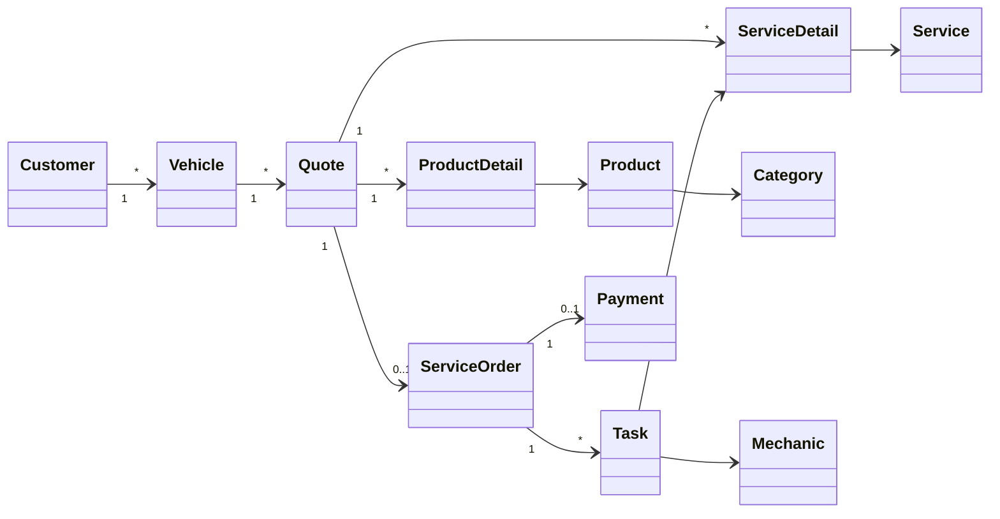

<div align="center">

# 🔧 MecaFix

**A complete management platform for automotive workshops — from the first quote to the final payment.**

[](https://github.com/Josemj-07/MecaFix/actions/workflows/ci.yml)


</div>

---

## Table of Contents

- [The Problem](#the-problem)
- [The Solution](#the-solution)
- [Business Logic](#business-logic)
- [Architecture](#architecture)
- [Design Principles & Patterns](#design-principles--patterns)
- [Technology Stack](#technology-stack)
- [Getting Started with Docker](#getting-started-with-docker)
- [Manual Setup (Any IDE)](#manual-setup-any-ide)
- [API Reference](#api-reference)
- [Testing & Quality](#testing--quality)
- [CI/CD](#cicd)
- [Project Structure](#project-structure)
- [About This Project](#about-this-project)

---

## The Problem

Small and mid-sized automotive workshops still run on paper notebooks, spreadsheets and WhatsApp messages. The consequences are predictable and expensive:

| Pain point | Real-world cost |
|---|---|
| Quotes written by hand | Prices are inconsistent, margins are guessed, quotes get lost |
| No traceability of a repair | Nobody can answer *"where is my car right now?"* |
| Mechanics assigned verbally | Double-booked staff, idle bays, unassigned jobs |
| Inventory tracked from memory | Stock-outs mid-repair and dead capital on the shelves |
| Payments reconciled manually | Partial payments go unnoticed, closed orders remain unpaid |
| No consolidated financial view | The owner has no idea which services are actually profitable |

The underlying issue is that a workshop's operation is a **stateful, multi-actor workflow** — and spreadsheets have no notion of state, rules or ownership.

## The Solution

**MecaFix** digitises that workflow end to end and, more importantly, **encodes the business rules in the software itself** instead of relying on staff discipline.

- 🧾 **Quoting** — build a quote from a catalog of services and parts, with prices frozen at quote time so later price changes never rewrite history.
- 🔄 **Guaranteed workflow** — a quote can only become a service order once approved; an order can only advance through its legal state transitions; an unfinished order can't be delivered.
- 👨‍🔧 **Traceable work** — every service in an order becomes a task assigned to a specific mechanic, with start and completion timestamps.
- 📦 **Live inventory** — stock and pricing are managed as first-class domain concepts, updated as parts are consumed.
- 💳 **Controlled payments** — the system validates whether the amount received actually covers the order total, making partial payments explicit instead of invisible.
- 🔐 **Role-based access** — `ADMINISTRATOR` runs daily operations; `OWNER` additionally sees the financial picture.

The result is a system that is **useful** (it removes real daily friction), **scalable** (the domain is isolated from frameworks and infrastructure) and **efficient** (a stateless JWT API over a normalised relational model, containerised and reproducible).

---

## Business Logic

The domain revolves around one central lifecycle. Everything else supports it.



**The rules the domain enforces**

1. **A vehicle always belongs to a customer.** Quotes are made for a vehicle, so every job is traceable to an owner.
2. **A quote is an immutable price agreement.** Services and products are captured with their *applied price* at the moment of quoting (`ServiceDetail`, `ProductDetail`). Items can only be added while the quote is `PENDING`.
3. **Only an approved quote becomes work.** Creating a service order from a non-approved quote is rejected by the domain, not by the UI.
4. **Order status is a state machine, not a string.** `OrderStatus` implements `nextOrderStatus()` per constant — `CREATED → IN_PROGRESS → FINALIZED → DELIVERED` — and advancing past `DELIVERED` or `CANCELED` raises `InvalidOrderStatusException`. Illegal transitions are simply unrepresentable.
5. **Work is decomposed into tasks.** Each service in the order becomes a `Task` assigned to a `Mechanic`, moving through its own status with `creationDate` / `finishedDate`, so throughput per mechanic is measurable.
6. **Mechanics have specialties.** `ENGINE`, `BRAKES`, `ELECTRICAL`, `SUSPENSION`, `GENERAL` — assignment can be filtered by qualification.
7. **Payment closes the loop.** A payment references its service order, records the method and the amount received, and is validated against the order total.
8. **Invariants live in value objects.** `Email`, `Dni`, `MobilePhone` and `Price` validate themselves at construction. An invalid email cannot exist in memory, let alone reach the database.

### Domain model



> The full relational diagram lives in [`doc/mecafix.md`](doc/mecafix.md), the class diagram in [`doc/ClassDiagram.md`](doc/ClassDiagram.md), and the complete user stories in [`doc/requirements.md`](doc/requirements.md).

---

## Architecture

The backend is built with **Clean Architecture** — concentric layers, an explicit use-case layer, and one non-negotiable dependency rule: **source code dependencies point only inward, toward the business rules.** Frameworks, the database and the web are details that plug in from the outside.

```
   ┌──────────────────────────────────────────────────────────────────────┐
   │  FRAMEWORKS & DRIVERS            infrastructure/                     │
   │  Spring Boot · Spring Security · JWT · PostgreSQL · Bean wiring      │
   │                                                                      │
   │   ┌──────────────────────────────────────────────────────────────┐   │
   │   │  INTERFACE ADAPTERS          adapter/in · adapter/out        │   │
   │   │  REST controllers · JPA entities · Mappers · Gateways        │   │
   │   │                                                              │   │
   │   │   ┌──────────────────────────────────────────────────────┐   │   │
   │   │   │  USE CASES                   application/            │   │   │
   │   │   │  Command ─▶ UseCase ─▶ Result · Application mappers   │   │   │
   │   │   │                                                      │   │   │
   │   │   │   ┌──────────────────────────────────────────────┐   │   │   │
   │   │   │   │  ENTERPRISE BUSINESS RULES     domain/       │   │   │   │
   │   │   │   │  Entities · Value Objects · Enums with       │   │   │   │
   │   │   │   │  behaviour · Ports · Domain exceptions       │   │   │   │
   │   │   │   │             (zero dependencies)              │   │   │   │
   │   │   │   └──────────────────────────────────────────────┘   │   │   │
   │   │   └──────────────────────────────────────────────────────┘   │   │
   │   └──────────────────────────────────────────────────────────────┘   │
   └──────────────────────────────────────────────────────────────────────┘

                    ────────  dependencies point inward  ────────▶
```

**The Dependency Rule is absolute: nothing in an inner circle knows anything about an outer one.**

A REST controller may call a use case; a use case may never know a controller exists. A use case may call a `*RepositoryPort`; the JPA gateway that implements it lives two rings out and is invisible to the code that uses it. Control flows inward and back out through **Dependency Inversion** — the interfaces are declared by the inner layer and implemented by the outer one. That is exactly what the `domain/port/**` + `adapter/out/**/gateway/**` pairing does.

| Layer (Clean Architecture) | Package | Responsibility | May depend on |
|---|---|---|---|
| **Entities** — enterprise business rules | `domain/` | Entities, value objects, enums with behaviour, repository interfaces (**ports**), domain exceptions | Nothing. No Spring, no JPA, no annotations. |
| **Use Cases** — application business rules | `application/` | One package per use case: `Command` → `UseCase` → `Result`, plus mappers | Domain only |
| **Interface Adapters** — inbound | `adapter/in/rest` | HTTP controllers translating requests into commands and results into responses | Use Cases |
| **Interface Adapters** — outbound | `adapter/out/persistence` | JPA entities, Spring Data repositories, **gateways** implementing the domain ports | Use Cases + Domain |
| **Frameworks & Drivers** | `infrastructure/` | Spring wiring, security, JWT, global exception handling | Everything |

**Why this matters:** the two inner circles — where every business rule lives — are pure Java 21 with zero framework dependencies. Spring, PostgreSQL and REST are deliberately kept at the edges, as *details*. Swapping PostgreSQL for MongoDB, or REST for gRPC, means writing new adapters in the outer rings; the business rules and their tests never change. That is what makes the codebase *scalable* in the sense that actually counts: scalable to change.

> Clean Architecture and Hexagonal Architecture are close relatives, and the concepts overlap deliberately. We follow Clean Architecture's layering and use-case orientation, and adopt its ports-and-adapters mechanism as the means of enforcing the Dependency Rule at the boundaries.

### Frontend architecture

The React client mirrors the same philosophy with a **feature-sliced** structure — each business capability owns its pages, API layer and state:

```
frontend/src/
├── features/          # auth · customers · vehicles · quotes · orders
│   └── <feature>/     #   inventory · services · mechanics · payments
│       ├── pages/     # UI
│       ├── api/       # HTTP access, isolated from components
│       └── store/     # Zustand state
├── domain/models/     # Shared TypeScript contracts mirroring the backend
├── components/layout/ # Sidebar · TopBar · MainLayout
├── routes/            # ProtectedRoute — route guards by role
└── config/axios.ts    # Single HTTP client: JWT injection + 401 auto-logout
```

---

## Design Principles & Patterns

This project was built as a deliberate exercise in applying software-engineering principles, not just in making features work.

### SOLID

| Principle | How it's applied |
|---|---|
| **S** — Single Responsibility | Every use case is its own class in its own package (`createquote/`, `approvequote/`, `starttask/`…). 40+ use cases, each with exactly one reason to change. |
| **O** — Open/Closed | `OrderStatus` uses constant-specific method implementations: adding a state means adding an enum constant, never editing a `switch`. |
| **L** — Liskov Substitution | `Customer` and `Mechanic` both extend `Person` and are usable wherever a `Person` is expected, without strengthening preconditions. |
| **I** — Interface Segregation | Ports are narrow and purpose-built (`JwtTokenPort`, `PasswordHasher`, `IPayable`, one repository port per aggregate) — no god-interfaces. |
| **D** — Dependency Inversion | Use cases depend on `*RepositoryPort` interfaces owned by the **domain**; the JPA gateways in `adapter/out` implement them. The database depends on the domain, never the reverse. |

### Patterns in use

- **Ports & Adapters (boundary crossing)** — the mechanism that enforces Clean Architecture's Dependency Rule: `domain/port/**` declares the contracts, `adapter/out/persistence/gateway/**` implements them.
- **Factory / Manual bean composition** — [`UseCaseConfig`](server/src/main/java/com/mecafix/infrastructure/config/UseCaseConfig.java) is a single `@Configuration` factory that assembles every use case from its ports. The application layer contains **no Spring annotations at all**, which keeps it framework-agnostic and trivially unit-testable.
- **Command / Result (DTO)** — each use case exposes an explicit `XCommand` input and `XResult` output, so HTTP shapes never leak into the domain.
- **Value Object** — `Email`, `Dni`, `MobilePhone`, `Price`: immutable, self-validating, primitive-obsession-free.
- **State pattern via enums** — `OrderStatus`, `TaskStatus`, `QuoteStatus` carry their own transition logic.
- **Mapper** — dedicated mappers at both boundaries (`application/**/mapper` for domain↔DTO, `adapter/out/persistence/mapper` for domain↔JPA entity) so persistence models never contaminate the domain.
- **Repository / Gateway** — Spring Data interfaces stay in the adapter; the domain only ever sees its own port.
- **Strategy** — `PasswordHasher` is a domain port with a `BCryptPasswordHasher` implementation; swapping the algorithm touches one class.
- **Chain of Responsibility** — `JwtAuthenticationFilter` plugs into the Spring Security filter chain.
- **Centralised error translation** — `GlobalExceptionHandler` maps 25+ typed domain exceptions to precise HTTP status codes, so controllers stay free of `try/catch` noise.

---

## Technology Stack

### Backend
| Technology | Version | Purpose |
|---|---|---|
| Java | 21 (LTS) | Records, sealed types, pattern matching |
| Spring Boot | 4.0 | Application framework |
| Spring Web | — | REST API |
| Spring Data JPA | — | Persistence adapter |
| Spring Security | — | Authentication & authorisation |
| Spring Validation | — | Request-level validation |
| Spring Actuator | — | Health & metrics endpoints |
| JJWT | 0.12.6 | JWT issuing and verification |
| Lombok | — | Boilerplate reduction |
| dotenv-java | 3.0.0 | Environment configuration |
| Gradle Wrapper | — | Reproducible builds |
| JUnit 5 + Mockito | — | Unit testing |
| JaCoCo | — | Coverage reporting |

### Frontend
| Technology | Version | Purpose |
|---|---|---|
| React | 19 | UI layer |
| TypeScript | 6.0 (strict) | Type safety across the client |
| Vite | 8 | Dev server & build tool |
| React Router | 7 | Routing and role-based guards |
| Zustand | 5 | Lightweight state management |
| Axios | 1.15 | HTTP client with JWT interceptors |
| Recharts | 3.8 | Dashboard visualisations |
| Lucide React | 1.12 | Icon set |

### Infrastructure
| Technology | Purpose |
|---|---|
| PostgreSQL 17 (Alpine) | Relational database |
| Docker & Docker Compose | Reproducible multi-service environment |
| GitHub Actions | CI: compile → test → build → release |
| Postman | Full API collection included in the repo |

---

## Getting Started with Docker

The fastest path. Frontend, backend and database come up together, and the schema plus seed data are loaded automatically on first run.

### Prerequisites
- [Docker](https://docs.docker.com/get-docker/) 20.10+
- Docker Compose v2 (`docker compose`, bundled with Docker Desktop / the `docker-compose-plugin`)

### Steps

**1. Clone the repository**

```bash
git clone https://github.com/Josemj-07/MecaFix.git
cd MecaFix
```

**2. Create the environment file**

Compose reads its secrets from `server/.env` (git-ignored — it is never committed). Create it:

```bash
cat > server/.env <<'EOF'
POSTGRES_PASSWORD=your_secure_password
JWT_SECRET=a_base64_secret_of_at_least_256_bits_for_HS256
JWT_EXPIRATION=86400000
EOF
```

> 💡 Generate a strong JWT secret with:
> ```bash
> openssl rand -base64 48
> ```

**3. Start the stack**

```bash
cd server
docker compose up -d --build
```

The first build compiles the Spring Boot jar inside a multi-stage image, so it takes a few minutes. Subsequent runs are near-instant. PostgreSQL only starts serving once its healthcheck passes, and the backend waits for it.

**4. Open the app**

| Service | URL / Port |
|---|---|
| Frontend | http://localhost:5173 |
| Backend API | http://localhost:8080 |
| Health check | http://localhost:8080/actuator/health |
| PostgreSQL | `localhost:5433` → container port `5432` |

**5. Sign in with the seeded account**

| Field | Value |
|---|---|
| Email | `admin@example.com` |
| Password | `123` |
| Role | `OWNER` |

> ⚠️ These are development credentials seeded by [`db/initdb.sql`](db/initdb.sql). Change them before any real deployment.

### Everyday commands

```bash
docker compose logs -f backend     # follow backend logs
docker compose ps                  # service status
docker compose restart backend     # restart one service
docker compose down                # stop (data is preserved in the volume)
docker compose down -v             # stop AND wipe the database volume
```

> The `initdb.sql` script only runs when the `mecafix-data` volume is empty. To re-seed from scratch, run `docker compose down -v` before bringing the stack back up.

---

## Manual Setup (Any IDE)

Prefer running services natively — IntelliJ IDEA, VS Code, Eclipse, NetBeans, whatever you like? Everything works standalone.

### Prerequisites
- **JDK 21+** (Temurin recommended) — the Gradle Wrapper is included, so no local Gradle install is needed
- **Node.js 20+** and npm
- **PostgreSQL 17** running locally

### 1. Database

```bash
# Create the database
createdb -U postgres mecafix

# Load schema + seed data
psql -U postgres -d mecafix -f db/initdb.sql
```

> Or use Docker for just the database and run the rest natively:
> ```bash
> docker run --name mecafix-db -e POSTGRES_DB=mecafix \
>   -e POSTGRES_PASSWORD=123 -p 5432:5432 \
>   -v "$(pwd)/db/initdb.sql:/docker-entrypoint-initdb.d/initdb.sql:ro" \
>   -d postgres:17-alpine
> ```

### 2. Backend

Create `server/.env`:

```env
JWT_SECRET=a_base64_secret_of_at_least_256_bits_for_HS256
JWT_EXPIRATION=86400000
```

Then run it:

```bash
cd server
./gradlew bootRun          # Linux / macOS
gradlew.bat bootRun        # Windows
```

The API is now on **http://localhost:8080**. Connection settings live in [`server/src/main/resources/application.properties`](server/src/main/resources/application.properties) — adjust `spring.datasource.*` if your local PostgreSQL differs from `localhost:5432`, user `postgres`.

<details>
<summary><b>Running from your IDE</b></summary>

- **IntelliJ IDEA** — `File ▸ Open` → select the `server/` folder → let it import the Gradle project → run `MecaFixApplication`. Add `JWT_SECRET` and `JWT_EXPIRATION` under *Edit Configurations ▸ Environment variables* if the `.env` isn't picked up.
- **VS Code** — install the *Extension Pack for Java*, open `server/`, then run `MecaFixApplication.java` from the Run panel.
- **Eclipse / NetBeans** — import as an existing Gradle project and run `MecaFixApplication` as a Java application.

</details>

**Useful Gradle tasks**

```bash
./gradlew test                     # run the test suite
./gradlew build                    # compile, test and package the jar
./gradlew build -x test            # package, skipping tests
./gradlew jacocoTestReport         # coverage → build/reports/jacoco/
java -jar build/libs/*.jar         # run the packaged artifact
```

### 3. Frontend

```bash
cd frontend
npm install
npm run dev
```

Vite serves the client on **http://localhost:5173** with hot module replacement. The API base URL is configured in [`frontend/src/config/axios.ts`](frontend/src/config/axios.ts) — point it elsewhere if your backend isn't on `localhost:8080`.

```bash
npm run build      # type-check and produce a production bundle
npm run preview    # serve the production build locally
```

---

## API Reference

The API is versioned under `/api/v1` and secured with JWT bearer tokens. `/auth/**` is public; everything else requires an `Authorization: Bearer <token>` header.

| Resource | Base path | Capabilities |
|---|---|---|
| Authentication | `/auth` | `login`, `register` (registering new users is `OWNER`-only) |
| Customers | `/api/v1/customers` | Create, get, list, update contact data, list a customer's vehicles |
| Vehicles | `/api/v1/vehicles` | Register, update mileage/colour, look up by plate |
| Mechanics | `/api/v1/mechanics` | Create, get, list, filter by specialty |
| Services | `/api/v1/services` | Create, get, list, update description and labour price |
| Categories | `/api/v1/categories` | Create, get, list |
| Products | `/api/v1/products` | Create, get, list, update stock, update prices |
| Quotes | `/api/v1/quotes` | Create, add items, get, list by customer, approve, reject |
| Service Orders | `/api/v1/service-orders` | Create from an approved quote, advance status, start task, complete task, get, list |
| Payments | `/api/v1/payments` | Register, get, validate coverage against the order total |

### Try it in 30 seconds

```bash
# 1. Authenticate
curl -X POST http://localhost:8080/auth/login \
  -H 'Content-Type: application/json' \
  -d '{"email":"admin@example.com","password":"123"}'

# 2. Call a protected endpoint with the returned token
curl http://localhost:8080/api/v1/customers \
  -H "Authorization: Bearer <YOUR_TOKEN>"
```

### Postman collection

[`MecaFix_Postman_Collection.json`](MecaFix_Postman_Collection.json) at the repository root covers every endpoint, ordered so you can walk the full business flow — customer → vehicle → quote → approval → service order → tasks → payment. Import it into Postman and run it top to bottom.

A narrated walkthrough of that same flow is documented in [`doc/mecafix_flujo_pruebas.md`](doc/mecafix_flujo_pruebas.md).

---

## Testing & Quality

Testing is where the architecture pays for itself: because use cases depend on ports rather than on Spring or JPA, **the entire application layer is tested with plain JUnit and Mockito — no Spring context, no database, no test containers.** The suite runs in seconds.

```
server/src/test/java/com/mecafix/
├── domain/model/entity/        # ServiceOrder, Task, Payment, Product,
│                               # Customer, Service — invariants & state machine
├── domain/model/valueobject/   # Email, Dni, MobilePhone, Price validation
└── application/**/usecase/     # Use cases with mocked ports
```

Coverage focuses on the parts that carry business risk: order state transitions, task lifecycle, payment validation, price and stock updates, and value-object invariants.

```bash
cd server
./gradlew test                # run everything
./gradlew jacocoTestReport    # HTML coverage report
```

Reports land in `server/build/reports/tests/test/` and `server/build/reports/jacoco/`.

---

## CI/CD

Every push and pull request to `main` or `development` triggers [`.github/workflows/ci.yml`](.github/workflows/ci.yml):

```
Checkout ─▶ JDK 21 (cached Gradle) ─▶ Verify compilation ─▶ Run tests
   ─▶ Build artifact ─▶ Upload jar + test reports
        └─▶ (on push to main) Create tagged GitHub Release
```

- Concurrent runs on the same ref are cancelled automatically, so CI never wastes minutes on stale commits.
- Test reports are uploaded **even when the build fails** (`if: always()`), so failures are always diagnosable.
- Merges to `main` publish a versioned release (`vYYYY.MM.DD-build.N`) with the runnable jar attached and auto-generated release notes.

Branching follows a simple GitFlow-inspired model: feature branches → `development` → pull request → `main`.

---

## Project Structure

```
MecaFix/
├── server/                                  # Spring Boot backend
│   └── src/main/java/com/mecafix/
│       ├── domain/                          # 🟢 Entities — pure business core, no frameworks
│       │   ├── model/
│       │   │   ├── entity/                  # ServiceOrder, Quote, Task, Payment…
│       │   │   ├── valueobject/             # Email, Dni, MobilePhone, Price
│       │   │   ├── enums/                   # OrderStatus, TaskStatus, Role…
│       │   │   └── contract/                # IPayable
│       │   ├── port/                        # Repository & service interfaces
│       │   └── exceptions/                  # Typed domain exceptions
│       ├── application/                     # 🔵 Use cases (Command → UseCase → Result)
│       │   └── <aggregate>/usecase/<action>/
│       ├── adapter/                         # 🟡 Interface adapters
│       │   ├── in/rest/                     #    Inbound — REST controllers
│       │   └── out/persistence/             #    Outbound — JPA entities, mappers, gateways
│       └── infrastructure/                  # 🔴 Frameworks & drivers — Spring, security, JWT
│           ├── config/                      # UseCaseConfig, DataInitializer
│           ├── security/                    # JwtService, filters, SecurityConfig
│           └── rest/exception/              # GlobalExceptionHandler
├── frontend/                                # React + TypeScript client
│   └── src/{features,domain,components,routes,config}/
├── db/initdb.sql                            # Schema + seed data
├── doc/                                     # Requirements, class & ER diagrams, test flow
├── .github/workflows/ci.yml                 # CI/CD pipeline
└── MecaFix_Postman_Collection.json          # Full API collection
```

---

## About This Project

MecaFix is built by a team of **university software engineering students** as a showcase of what we can do when a project is treated as production software rather than a course deliverable.

We used a real, messy business domain on purpose — one with state machines, money, roles and workflows — because it's the kind of problem where architecture actually earns its keep. Along the way we practised:

- **Clean Architecture** — concentric layers, an explicit use-case layer, and a domain with zero framework dependencies
- **SOLID principles** and classic design patterns applied where they solve a real problem, not as decoration
- **Domain-Driven Design** building blocks: entities, value objects, aggregates and ubiquitous language
- **Test-oriented design** — architecture chosen so the business rules are fast and cheap to test
- **Full containerisation** so the whole stack runs anywhere with a single command
- **Automated CI/CD** with quality gates, artifact publishing and versioned releases
- **Modern full-stack development** — Java 21 + Spring Boot 4 on the backend, React 19 + TypeScript on the frontend

The goal was never just *"it works"*. It was **it works, it's tested, it's readable, and the next developer can change it without fear.**

### Contributing

1. Fork the repository
2. Create your branch from `development` (`git checkout -b feature/my-feature`)
3. Commit your changes and make sure `./gradlew test` passes
4. Open a pull request against `development`

---

<div align="center">

**Built with care by university students who take software craftsmanship seriously.**

⭐ If this project is useful to you, consider giving it a star.

</div>
