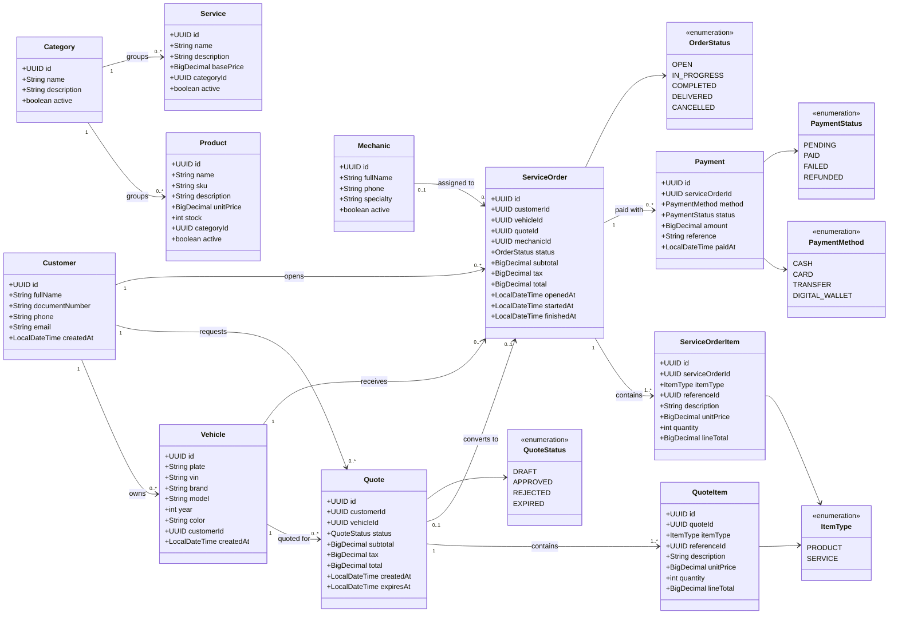

# Class diagram for MecaFix ⚙️

The objective of the class diagram is to show the modeling of the domain layer, allowing
us to observe what each and every one of the entities that compose it are **made of**, and what relationships exist between them.

Creating a diagram helps to *structure* the design of any type of solution in a better way, since visually it becomes possible to
analyze the responsibilities that each actor holds within the scope of the problem, and it avoids carrying into the implementation phase possible errors in the representation of the entities
or in how they interact with each other; it is always necessary to think before writing any line of code to prevent multiple
rethinks from occurring during development due to flaws that were not identified from the start thanks to a lack of planning.

The diagram was made under the **UML** standard

