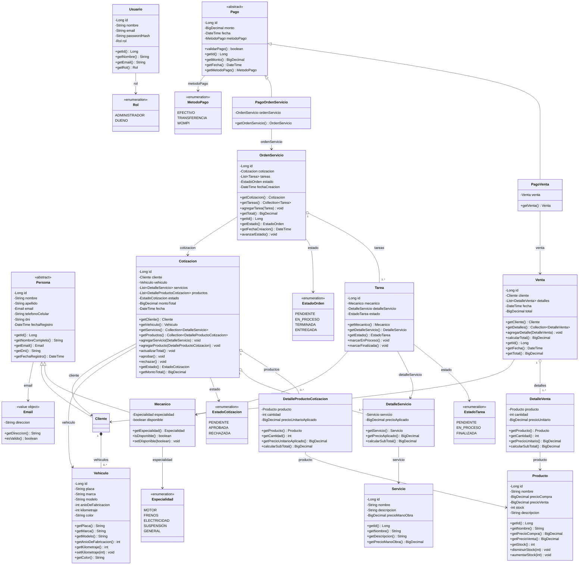

# Diagrama de clases para MecaFix ⚙️

El objetivo del diagrama de clases es mostrar modelado de la capa de dominio, permitiendo 
observar de qué se **componen** todas y cada una de las entidades que la conforman, y que relaciones existen entre estas.

Realizar un diagrama ayuda a *estructurar* de mejor manera el diseño de cualquier tipo de solución, ya que de manera visual se logra
analizar las responsabilidades que cada actor posee dentro del radio de acción del problema, y se evita llevar a la parte de implementación posibles errores de representación de las entidades
o de como estas interactúan con las otras; siempre es necesario pensar antes de escribir cualquier línea de código para evitar que en el desarrollo ocurran múltiples
re-planteamientos debido a fallas encontradas y que en un principio no fueron identificadas gracias a la falta de planificación.

El diagrama se realizó bajo el estándar **UML**

